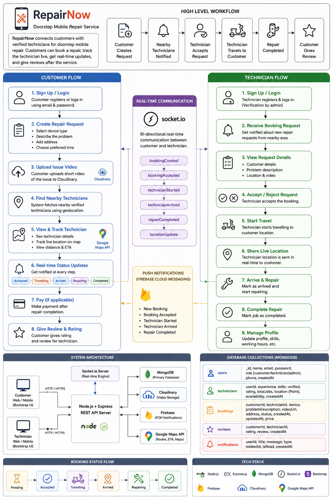
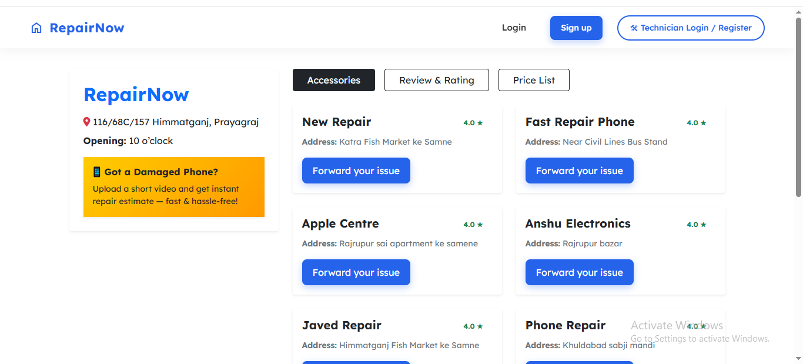
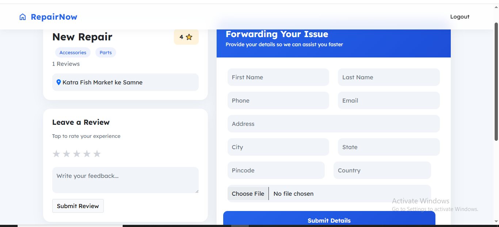
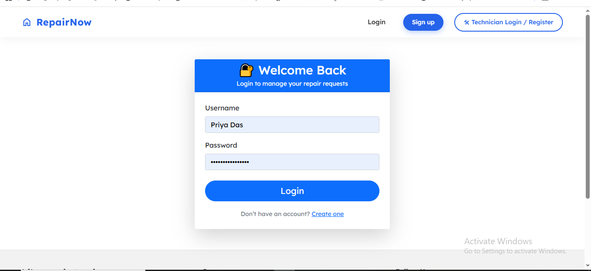
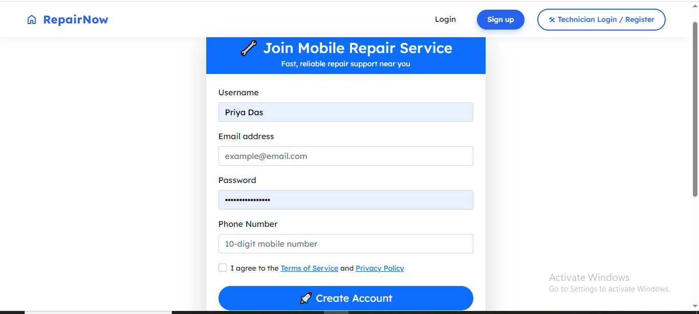
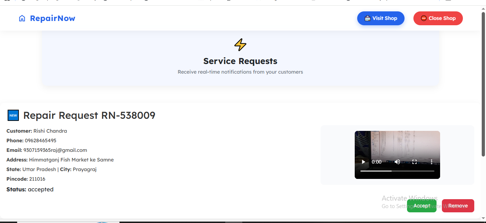
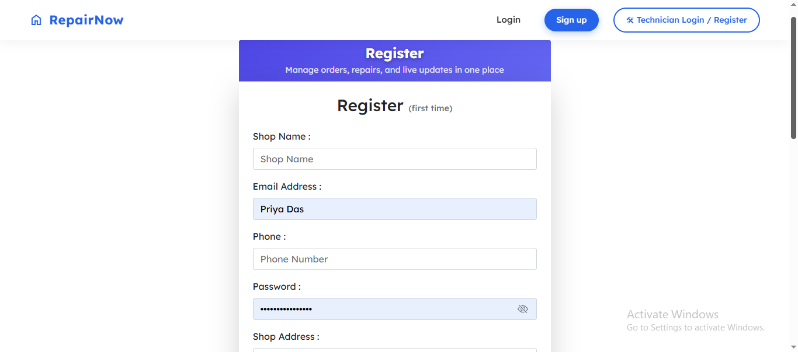

# RepairNow – Full Stack Mobile Repair Service Platform

RepairNow is a doorstep mobile repair platform that allows users to upload phone issue videos, book trusted technicians, track real-time location, and receive secure repair services without visiting repair shops.

---

[](https://nodejs.org/)
[](https://expressjs.com/)
[](https://www.mongodb.com/)
[](https://socket.io/)
[](https://firebase.google.com/)
[](https://getbootstrap.com/)


---

## Workflow


---

## Tech Stack

| Layer | Technology |
|---|---|
| Frontend | HTML, CSS, Bootstrap 5, JavaScript |
| Backend | Node.js, Express.js |
| Database | MongoDB + Mongoose |
| Real-Time | Socket.io |
| Maps & ETA | Google Maps, Directions API, Distance Matrix API |
| Notifications | Firebase Admin SDK |
| Video Upload | Cloudinary |
| AI Diagnostics | Gemini API |
| Deployment | Render |

---

## Features

- 📹 **Video diagnostics** — customers upload a short video of their broken phone before booking
- 📍 **Live tracking** — real-time technician location on Google Maps with ETA countdown
- 🔔 **Push notifications** — Firebase alerts on every status change (accepted → en route → arrived → done)
- ✅ **Verified technicians** — admin approval system before a technician can accept jobs
- 🤖 **AI diagnostics** — Gemini API analyses the issue description to suggest repair type
- ⭐ **Reviews** — customers rate and review after every completed repair
  

---


## Technical Highlights

- Built secure RESTful APIs with Express.js following MVC architecture — routes, controllers, and models cleanly separated
- Implemented real-time bidirectional communication with Socket.io rooms scoped per booking — zero cross-user event leakage
- Integrated Google Directions API and Distance Matrix API for live route rendering and ETA calculation
- Designed MongoDB schemas with indexing and `populate()` references across users, bookings, and reviews
- Triggered Firebase Admin push notifications server-side on every booking status transition
- Streamed video uploads through Multer directly to Cloudinary — no files stored on the server
- Used Gemini API to analyse issue descriptions and suggest likely repair categories

---

## Screenshots

### Homepage & Repair Shop Listings


### Customer Issue Reporting & Video Upload


### Customer Login


### Customer Signup


### Technician Dashboard


### Technician Registration


---

## 🛠️ Installation

### Clone the repository

```bash
git clone https://github.com/RishiRaj5495/Mobile_Repair.git
```

### Navigate to project folder

```bash
cd Mobile_Repair
```

### Install dependencies

```bash
npm install
```

### Start the server

```bash
npm run dev
```
---

## 🔐 Environment Variables

Create a `.env` file in the root directory and add:

```env
SECRET=your_secret_key

FIREBASE_SERVICE_ACCOUNT_PATH=path_to_service_account.json

FRONTEND_URL=your_frontend_url

CLOUD_NAME=your_cloudinary_name
CLOUD_API_KEY=your_cloudinary_api_key
CLOUD_API_SECRET=your_cloudinary_api_secret

MONGODB_URI=your_mongodb_connection_string

FIREBASE_API_KEY=your_firebase_api_key
FIREBASE_AUTH_DOMAIN=your_project.firebaseapp.com
FIREBASE_PROJECT_ID=your_project_id
FIREBASE_STORAGE_BUCKET=your_bucket.appspot.com
FIREBASE_SENDER_ID=your_sender_id
FIREBASE_APP_ID=your_app_id
FIREBASE_MEASUREMENT_ID=your_measurement_id

GOOGLE_MAPS_API_KEY=your_google_maps_api_key

GOOGLE_APPLICATION_CREDENTIALS=path_to_google_credentials.json

GEMINI_API_KEY=your_gemini_api_key
```

