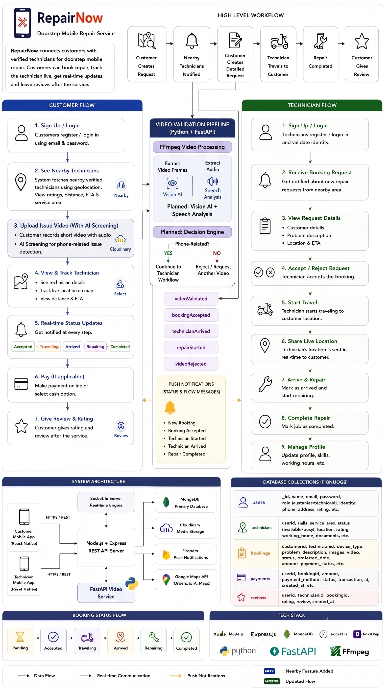
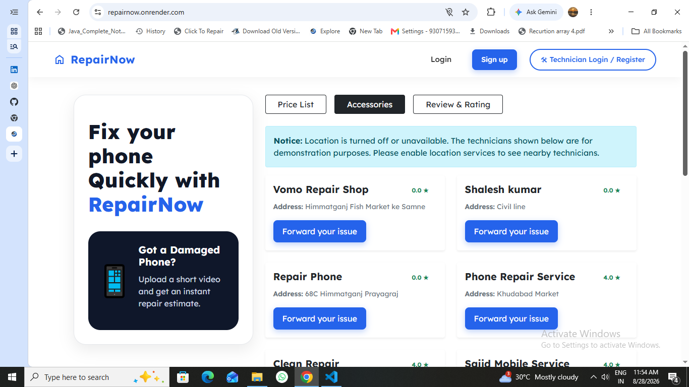
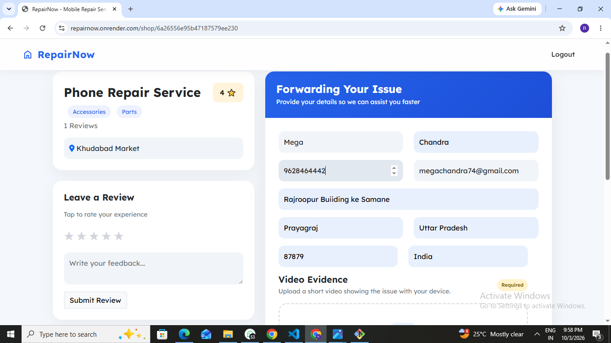
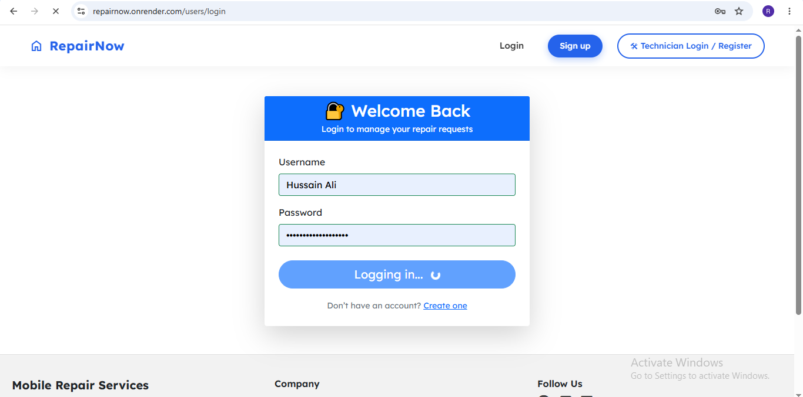
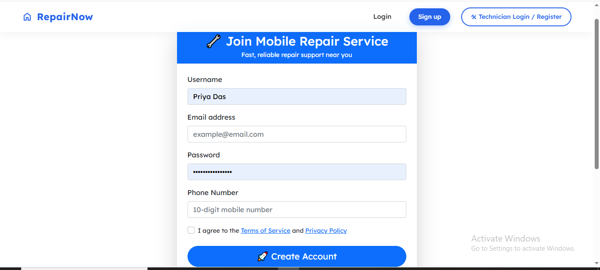
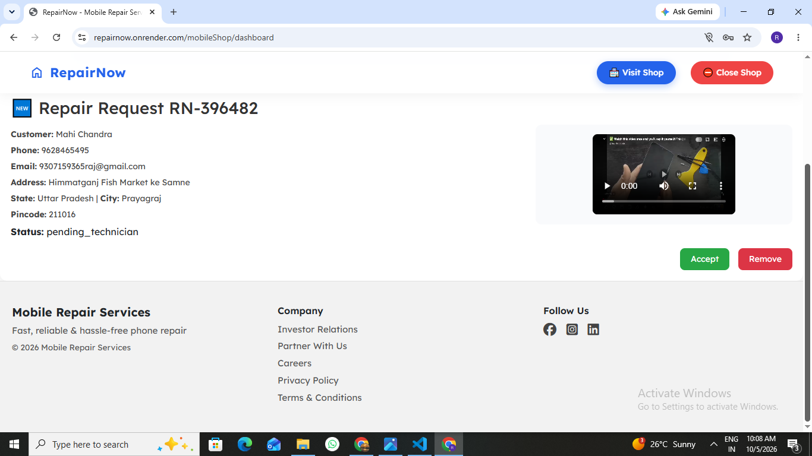
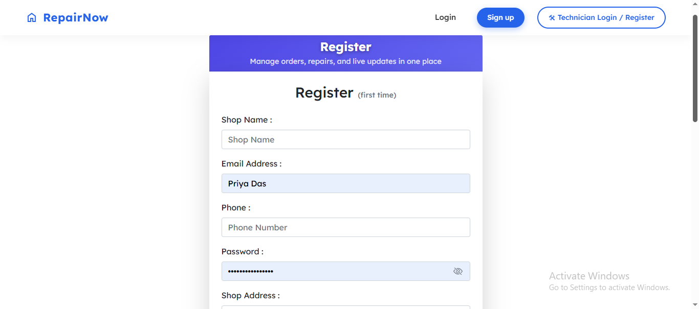

# RepairNow – Full-Stack Mobile Repair Platform with Real-Time Technician Dispatch

RepairNow is a full-stack doorstep mobile repair platform that connects customers with nearby technicians based on their repair requirements and location.

Customers can submit repair issue videos, receive AI-assisted video validation, book technicians, make online payments, and track technician location and booking status in real time.

The platform combines a Node.js/Express backend with MongoDB, Redis, Kafka, Socket.IO, Razorpay, and a separate Python/FastAPI AI video-processing service deployed on AWS EC2.

---

[](https://nodejs.org/)
[](https://expressjs.com/)
[](https://www.mongodb.com/)
[](https://socket.io/)
[](https://firebase.google.com/)
[](https://getbootstrap.com/)


---
## Demo

🌐 **Live Application:** [RepairNow](https://repairnow.onrender.com)

💻 **Source Code:** [GitHub Repository](https://github.com/RishiRaj5495/Mobile_Repair)

---

## Features

- 📹 **AI video validation** — customers submit repair videos that are analyzed using visual and speech evidence before technician assignment
- 📍 **Live technician tracking** — real-time technician location and booking-status updates using Socket.IO and Google Maps
- 🔔 **Push notifications** — Firebase notifications triggered by booking-status transitions
- 🧑‍🔧 **Technician discovery** — MongoDB geospatial queries find nearby technicians within a configurable search radius
- 💳 **Online payments** — Razorpay payment processing with webhook signature verification
- ⚡ **Performance optimization** — Redis caching reduces repeated MongoDB reads
- 📨 **Asynchronous processing** — Kafka producer-consumer architecture for booking events
- ⭐ **Reviews** — customers can rate completed repair services
  

---

## Workflow


---

##  AI Video Validation Pipeline
   Customer repair videos are processed by a dedicated AI service rather than directly inside the main Node.js application.

 
```text
Customer
   │
   │ Repair Video
   ▼
┌─────────────────────┐
│   RepairNow Backend │
│ Node.js + Express   │
└──────────┬──────────┘
           │
           ▼
┌─────────────────────┐
│   AI Video Service  │
│      AWS EC2        │
│ FastAPI + FFmpeg    │
└──────────┬──────────┘
           │
      ┌────┴────┐
      ▼         ▼
    YOLO     Faster-Whisper
   Vision     Speech
      │         │
      └────┬────┘
           ▼
┌─────────────────────┐
│ Validation Decision   │
│ VALID / REVIEW /    │
│ INVALID             │
└──────────┬──────────┘
           │
     ┌─────┴─────┐
     ▼           ▼
 Technician    Request
  Workflow    New Video
```

---
## Architecture

RepairNow uses a service-separated architecture:

- **Web application:** Node.js + Express + EJS/Bootstrap
- **Application data:** MongoDB
- **Caching:** Redis
- **Asynchronous processing:** Apache Kafka + KafkaJS
- **Real-time communication:** Socket.IO
- **Payments:** Razorpay + webhook signature verification
- **AI inference:** Python + FastAPI
- **Video processing:** FFmpeg
- **Vision analysis:** YOLO
- **Speech analysis:** Faster-Whisper
- **AI deployment:** AWS EC2

The AI service runs independently from the main backend because video processing and inference require significantly more compute than normal API operations.

---

## Tech Stack

| Layer | Technology |
|---|---|
| Frontend | EJS, HTML, CSS, Bootstrap, JavaScript |
| Backend | Node.js, Express.js, REST APIs |
| Database | MongoDB, Mongoose |
| Caching | Redis |
| Messaging | Apache Kafka, KafkaJS |
| Real-Time | Socket.IO |
| AI Service | Python, FastAPI |
| AI / Video | YOLO, Faster-Whisper, FFmpeg |
| Deployment | AWS EC2, Render |
| Storage | Cloudinary |
| Notifications | Firebase Admin SDK, FCM |
| Maps & ETA | Google Maps, Directions API, Distance Matrix API |
| Payments | Razorpay, Webhooks |
| Developer Tool | Git, Docker, Postman |

---

## Technical Highlights

- Built 15+ RESTful APIs with Node.js and Express.js for authentication, booking workflows, technician management, video validation, and location tracking.

- Implemented Redis caching with cache invalidation, reducing MongoDB reads by approximately 75% and improving measured response time from approximately 489 ms to 109 ms during local testing.

- Implemented Apache Kafka with KafkaJS using a producer-consumer architecture for asynchronous booking-event processing.

- Implemented Socket.IO-based real-time technician location and booking-status synchronization, reducing unnecessary polling by approximately 80%.

- Integrated Razorpay Webhooks with HMAC-SHA256 signature verification to securely process payment events and synchronize payment status with MongoDB.

- Built a separate AI video-validation service using Python, FastAPI, FFmpeg, YOLO, and Faster-Whisper to analyze visual and speech evidence from customer repair videos.

- Deployed the AI inference service on AWS EC2 as a systemd-managed FastAPI service, keeping compute-intensive video processing separate from the main application backend.

- Implemented MongoDB 2dsphere geospatial queries using `$near` and `$geoNear` to discover nearby technicians within a configurable search radius.

- Integrated Google Directions API and Distance Matrix API for route calculation and technician ETA estimation.

- Used Firebase Admin SDK to trigger server-side push notifications during booking-status transitions.
---

## Architecture Decisions

### Why a separate AI service?

Video processing involves frame extraction, object detection, and speech transcription. These workloads are more resource-intensive than normal API requests, so the AI pipeline is isolated into a FastAPI service running on AWS EC2.

### Why Redis?

Redis is used to cache frequently accessed data and reduce repeated MongoDB queries. Cache invalidation is performed when relevant application data changes.

### Why Kafka?

Kafka is used for asynchronous booking-event processing so event-driven operations do not need to block the main request flow.

### Why Socket.IO?

Socket.IO provides real-time communication for technician location and booking-status updates without relying on continuous polling.

### Why Razorpay Webhooks?

Razorpay webhooks allow the backend to receive payment events server-side. HMAC-SHA256 signature verification is used to verify webhook authenticity before updating payment status.
---
## ## Engineering Highlights

| Area | Result |
|---|---|
| REST APIs | 15+ |
| MongoDB read reduction | ~75% with Redis caching |
| Measured response time | ~489 ms → ~109 ms |
| Polling reduction | ~80% using Socket.IO |
| Database collections | 6+ |
| AI processing | YOLO + Faster-Whisper + FFmpeg |


---
## Project Status

🟢 Core RepairNow platform — Working  
🟢 Real-time technician tracking — Working  
🟢 Online payments — Working  
🟢 AI video validation — Working  
🟢 AWS-hosted AI service — Working  
---


## Screenshots

### Homepage & Repair Shop Listings


### Customer Issue Reporting & Video Upload


### Customer Login


### Customer Signup


### Technician Dashboard


### Technician Registration


---

## Project Structure

```text
Mobile_Repair/
├── AI-Service/
│   ├── app.py
│   ├── requirements.txt
│   ├── Dockerfile
│   ├── yolo11n.pt
│   ├── test_yolo.py
│   ├── test_yolo_videos.py
│   └── services/
│       ├── audio_processor.py
│       ├── decision_engine.py
│       ├── semantic_analyzer.py
│       ├── speech_processor.py
│       ├── video_processor.py
│       └── visual_analyzer.py
│
├── Models/
│   ├── mobileShops.js
│   ├── notification.js
│   ├── orders.js
│   ├── ratings.js
│   └── users.js
│
├── config/
│   ├── kafka.js
│   ├── kafkaConsumer.js
│   └── redis.js
│
├── controllers/
│   └── users.js
│
├── routes/
│   ├── AI-flow.js
│   ├── allNearbyTechnician.js
│   ├── booking.js
│   ├── eta.js
│   ├── fcm.js
│   ├── mobileShops.js
│   ├── orders.js
│   ├── razorpayWebhook.js
│   └── users.js
│
├── middleware/
│   └── middlewear.js
│
├── utils/
│   ├── ExpressError.js
│   └── wrapAsync.js
│
├── public/
│   ├── css/
│   │   └── style.css
│   ├── js/
│   │   ├── admin.js
│   │   ├── approaching.js
│   │   ├── firebase-config.js
│   │   ├── mobileShops.js
│   │   ├── orderTracks.js
│   │   ├── product.js
│   │   ├── ratings,js
│   │   ├── script.js
│   │   └── technicianTrack.js
│   ├── images/
│   └── videos/
│
├── views/
│   ├── includes/
│   ├── layouts/
│   ├── listings/
│   ├── users/
│   └── error.ejs
│
├── images/
│   ├── Architecture.png
│   ├── FullWorkflow.png
│   ├── Homepage.png
│   ├── Workflow.png
│   └── ...
│
├── app.js
├── sockets.js
├── cloudConfig.js
├── Dockerfile
├── docker-compose.yml
├── package.json
├── package-lock.json
└── README.md
```

### Main Components

- **`routes/`** — API and application routes for bookings, technicians, payments, maps/ETA, notifications, and AI video validation.
- **`Models/`** — MongoDB/Mongoose data models for users, shops, orders, notifications, and ratings.
- **`config/`** — Redis and Kafka configuration and Kafka consumer setup.
- **`sockets.js`** — Socket.IO real-time communication for technician tracking and booking updates.
- **`AI-Service/`** — Separate Python/FastAPI service for video processing and AI-based validation.
- **`AI-Service/services/`** — Video/audio processing, YOLO visual analysis, speech processing, semantic analysis, and decision logic.
- **`public/` and `views/`** — Frontend assets and EJS views.
- **`images/`** — Architecture diagrams and project screenshots.
- **`Dockerfile` / `docker-compose.yml`** — Containerization and local service orchestration.
```

---

## 🛠️ Installation

### Clone the repository

```bash
git clone https://github.com/RishiRaj5495/Mobile_Repair.git
```

### Navigate to project folder

```bash
cd Mobile_Repair
```

### Install dependencies

```bash
npm install
```

### Start the server

```bash
npm run dev
```
---

## 🔐 Environment Variables

Create a `.env` file in the root directory and add:

```env
SECRET=your_secret_key

REDIS_URL=your_redis_connection_string

KAFKA_BROKER=your_kafka_bootstrap_server
KAFKA_USERNAME=your_kafka_api_key
KAFKA_PASSWORD=your_kafka_api_secret

FRONTEND_URL=your_frontend_url

CLOUD_NAME=your_cloudinary_name
CLOUD_API_KEY=your_cloudinary_api_key
CLOUD_API_SECRET=your_cloudinary_api_secret

MONGODB_URI=your_mongodb_connection_string

FIREBASE_API_KEY=your_firebase_api_key
FIREBASE_AUTH_DOMAIN=your_project.firebaseapp.com
FIREBASE_PROJECT_ID=your_project_id
FIREBASE_STORAGE_BUCKET=your_bucket.appspot.com
FIREBASE_SENDER_ID=your_sender_id
FIREBASE_APP_ID=your_app_id
FIREBASE_MEASUREMENT_ID=your_measurement_id
FIREBASE_SERVICE_ACCOUNT_PATH=path_to_service_account.json

GOOGLE_MAPS_API_KEY=your_google_maps_api_key

GOOGLE_APPLICATION_CREDENTIALS=path_to_google_credentials.json

GEMINI_API_KEY=your_gemini_api_key
```

